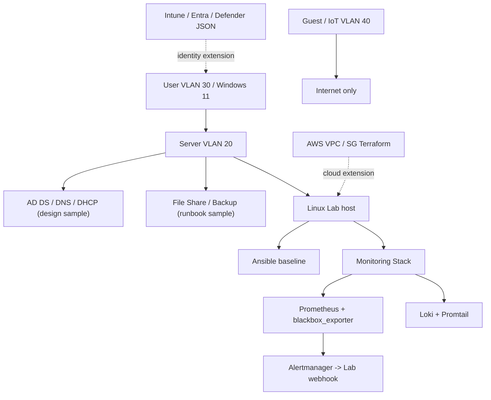

# Detailed Infrastructure Design - Portfolio Lab

## 1. 目的と境界

この文書は、ポートフォリオ内のインフラ成果物を一つの設計として読み解けるようにする親文書です。実装状況を明確にし、**資料として設計したもの** と **コード化したもの** と **自動実証するもの** を混同しません。

対象職種は IT サポート、社内 SE 補助、インフラ運用支援です。本番環境の運用経験や実在企業の構成を示す資料ではありません。

### 状態ラベル

| ラベル | 意味 |
|---|---|
| `実装 + 静的検証` | 設定またはコードが存在し、CI で構文 / lint / unit test を確認する |
| `実装 + 動作ドリル` | 構成を起動し、障害注入と復旧まで workflow で検証する |
| `設計サンプル` | 運用判断・設定案を文書化したもの。実テナント / 実機への適用は示さない |
| `本番化差分` | Lab では実装せず、本番に必要な追加要件として管理する |

## 2. 構成概要



## 3. 実装状況

| 領域 | 実体 | 状態 | 現時点で示せること |
|---|---|---|---|
| Windows / VLAN | [`infra-lab.html`](./infra-lab.html) | 設計サンプル | セグメント、一次切り分け、証跡と引き継ぎ判断 |
| Linux 一次対応 | [`linux-lab.html`](./linux-lab.html), [`support-scripts/linux-triage.sh`](./support-scripts/linux-triage.sh) | 実装 + 静的検証 | 読み取り中心の確認順と bash 構文検証 |
| Linux baseline | [`ansible/`](./ansible/) | 実装 + 静的検証 | SSH / UFW / fail2ban / auditd 等の定義と lint |
| 観測 / 通知 | [`monitoring-stack/`](./monitoring-stack/) | 実装 + 動作ドリル | Metrics、Logs、外形監視、アラート通知と解消通知 |
| 障害ドリル | [`verified-lab/`](./verified-lab/) | 実装 + 動作ドリル | HTTP ターゲット停止を検知して復旧まで追跡 |
| AWS Network | [`cloud-lab/terraform/`](./cloud-lab/terraform/) | 実装 + 静的検証 | VPC / Subnet / SG 設計、`validate` と安全条件 |
| AD / M365 作業 | [AD / M365 変更ケース](https://ns7jp.github.io/support-docs/ad-m365-change-case.html) | 設計サンプル | 承認、作業、検証、ロールバックの流れ |
| Intune 設定 | [`support-docs/m365-policy-examples/`](./support-docs/m365-policy-examples/) | 実装 + dry-run 検証 | Compliance / Configuration JSON の解析と適用パス |
| Conditional Access / Defender | 同上 | 設計サンプル | JSON 方針と段階展開。実テナント適用は未実施 |
| Backup / DR | [Backup / Restore Runbook](https://ns7jp.github.io/support-docs/backup-restore-runbook.html) | 設計サンプル | RTO / RPO、月次テスト、年次ドリル計画 |

## 4. 論理構成台帳

| ゾーン / 対象 | 設計値 | 役割 | 主な制御 |
|---|---|---|---|
| DMZ VLAN 10 | `192.0.2.0/28` | 公開サービス想定 | 内部への戻りは明示 ACL のみ |
| Server VLAN 20 | `10.0.20.0/24` | AD / DNS / File / Monitoring | User から必要ポートのみ |
| User VLAN 30 | `10.0.30.0/23` | Windows / M365 端末 | Guest から分離 |
| Guest / IoT VLAN 40 | `10.0.40.0/24` | 来客・機器 | Internet 出口のみ |
| AWS Lab VPC | `10.20.0.0/16` | クラウド拡張想定 | SSH は明示 `admin_cidr` のみ |
| Docker Monitoring | `monitoring` bridge | 実証用 Linux 監視 | ローカルポート、外部公開前提なし |

## 5. 運用設計

### 5.1 検知から復旧まで

| フェーズ | Lab での実装 | 本番化で追加するもの |
|---|---|---|
| Observe | Prometheus / Loki / blackbox_exporter | windows_exporter、CloudWatch、長期保持 |
| Alert | `LabProbeTargetDown`、Alertmanager webhook | Teams / メール / オンコール、抑止、認証 |
| Respond | [Verified Lab Runbook](https://ns7jp.github.io/verified-lab/runbook.html) | 影響利用者、承認、エスカレーション |
| Recover | 停止コンテナの再起動、resolved 配送確認 | RTO / RPO 計測、データ復元、利用者承認 |
| Learn | CI artifact、架空 Postmortem の型 | 実障害 Postmortem と改善チケット |

### 5.2 SLI / SLO

動作ドリルで直接測定する SLI は、blackbox_exporter が返す `probe_success` の 0 / 1 値です。

```promql
avg_over_time(probe_success{job="blackbox-http", service="lab-http-target"}[5m])
```

本 Lab は通知配線の再現性を確認するための短時間ドリルであり、月次 SLO 実績を主張しません。月次 SLO と Error Budget の設計例は [SLO / Error Budget](https://ns7jp.github.io/support-docs/slo-error-budget.html) に分離しています。

## 6. 権限と秘密情報

| 対象 | Lab の扱い | 本番化要件 |
|---|---|---|
| Grafana | ローカル検証用初期認証 | SSO / RBAC / secret 管理 |
| Ansible 鍵 | ダミー公開鍵 | Vault / ローテーション / 失効手順 |
| Terraform | 認証不要の validate が中心 | remote state / lock / IAM role / Secrets |
| M365 | 架空 ID、dry-run 中心 | テストテナント、最小権限、承認ログ |
| Alertmanager | ローカル webhook | TLS、認証、通知先 secret、オンコール |

## 7. 検証マトリクス

| 検証 | 自動化 | 証跡 |
|---|---|---|
| HTML 構造 / 内部リンク / 画像サイズ | `static-check.yml` | workflow run |
| PowerShell 判定ロジック / 静的解析 | `pwsh-tests.yml` | Pester artifact / run |
| Prometheus / Loki / Compose 設定 | `infra-check.yml` | workflow run |
| Terraform fmt / validate / security assertions | `infra-check.yml` | workflow run |
| Ansible syntax / lint | `infra-check.yml` | workflow run |
| M365 JSON と Intune dry-run | `infra-check.yml` | workflow run |
| 外形監視の障害発火 / Alertmanager 配送 / 復旧 | `verified-lab.yml` | `verified-monitoring-incident-evidence` artifact |

## 8. 次に実機で記録する事項

以下は設計済みですが、実機またはテストテナントでの適用記録を別途残すまで「実測済み」とは扱いません。

1. Ubuntu VM への Ansible 初回適用と二回目 `changed=0` の記録
2. テストデータのバックアップ、復元、ハッシュ一致、所要時間
3. Windows exporter を用いたファイルサーバー I/O 監視
4. Microsoft 365 テストテナントでの Intune / Conditional Access の report-only 結果
5. AWS sandbox での `terraform plan`、Flow Logs、Budget Alert の確認

本番相当で追加する要件一覧は [Production Readiness](https://ns7jp.github.io/production-readiness.html) を参照してください。
