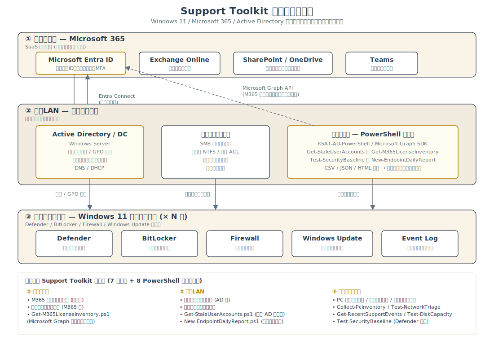

# Support Docs — IT サポート実務向けドキュメント集

ITサポート・社内SE・運用監視業務で実際に使われる手順書・事例集をまとめたフォルダです。**Windows 11 + Microsoft 365 + Active Directory** を標準的な業務環境として想定し、現場で参考になる粒度で記述しています。

ポートフォリオ作品（Web アプリ・サーバー監視ツール）が「**コードが書けること**」の証明であるのに対し、このフォルダのドキュメントは「**手順書を整備し、ナレッジを共有できること**」の証明として用意しました。

---

## 🗺 想定環境構成図

各手順書・スクリプトが「**どの層のどのコンポーネントに効くか**」を 1 枚で把握できるよう、想定するシステム構成を図にしています。クラウド (Microsoft 365) ・ 社内LAN (Active Directory / ファイルサーバー / 管理者端末) ・ エンドポイント (Windows 11) の 3 層と、本フォルダ + `../support-scripts/` の対応関係を示します。

> ポートフォリオサイト上でも同じ図を [Works ページ](https://ns7jp.github.io/works.html#work-support-toolkit) に掲載しています。

---

## 📂 収録ドキュメント

### 🛠 標準業務 手順書

#### 1. [PC キッティング手順書](./pc-kitting-guide.md)

新入社員に Windows 11 PC を配布する際の標準手順をまとめたチェックリスト形式の手順書。受領・検品から、Windows 初期設定、Active Directory 参加、Microsoft 365 導入、セキュリティ設定、ユーザー引き渡しまで全工程を網羅しています。

#### 2. [退職者アカウント停止手順書](./account-offboarding-guide.md)

退職・異動者の AD/M365 アカウント停止と関連リソース引き継ぎの標準手順書。情報漏洩・不正アクセス・ライセンス無駄消費を防ぐための時系列フロー（最終日 → 翌営業日 → 30 日 → 90 日）と、PowerShell コマンド例を掲載。

#### 3. [共有フォルダ・アクセス権限管理手順書](./shared-folder-access-management.md)

ファイルサーバー / SharePoint / OneDrive の権限を、最小権限の原則に沿って付与・変更・削除・棚卸しするための手順書。AD グループ単位の標準設計、四半期棚卸しスクリプト、よくある落とし穴を収録。

#### 4. [Microsoft 365 ライセンス管理手順書](./m365-license-management.md)

ライセンス新規割当・変更・取消・棚卸しの標準手順書。グループベースライセンス（GBL）の活用、月次棚卸しによる利用率分析、コスト最適化の判断フローを掲載。

---

### 🚨 障害対応 / インシデント対応

#### 5. [障害対応事例集（10 ケース）](./troubleshooting-case-studies.md)

ヘルプデスクでよく問い合わせを受ける10ケースを「**現象 → 影響範囲 → 切り分け → 想定原因 → 対応 → 再発防止**」の6項目で整理した事例集。

**含まれるケース**：PC起動不可 / ネット接続不可 / メール送受信不可 / 印刷不可 / パスワードロック / Office ライセンスエラー / VPN接続不可 / 共有フォルダアクセス不可 / PC低速化 / ファイル破損

#### 6. [重大インシデント対応プレイブック](./incident-response-playbook.md)

P1 / P2 重大度の事案で発動する、検知から事後分析までの定型フロー。役割分担（IC / Tech Lead / Comms / Scribe）、標準タイムライン、報告テンプレート、ポストモーテムの進め方をまとめています。

#### 7. [マルウェア感染疑い対応フロー](./malware-suspected-response.md)

感染兆候の判断基準から、即時隔離（5 分以内）、影響範囲の特定、検体保全、復旧、事後対応まで。電源切断 vs シャットダウンの判断基準、横展開検知の PowerShell クエリ等を収録。

---

### 🧰 関連: 実務 PowerShell スクリプト

#### 8. [support-scripts/](../support-scripts/)

ドキュメントから参照される実行可能スクリプト集。端末一次確認、セキュリティ監査、AD/M365 棚卸しまで 8 本収録。

---

## 📋 ドキュメント整備で意識した点

- **チェックリスト化**: 抜け漏れを防ぐため、手順は番号付き or `[ ]` チェックボックスで列挙
- **想定読者の明示**: 誰のためのドキュメントかを冒頭に記載
- **環境条件の明記**: 「Windows 11 / Microsoft 365 / AD」など、適用範囲を最初に提示
- **切り分けの順序**: 現象 → 範囲 → 原因 → 対応 の順で、感覚的でなく論理的に進める構成
- **チケット化のしやすさ**: 受付内容、確認コマンド、判断、対応時間目安、エスカレーション基準を追記
- **再発防止の言及**: 単発対応で終わらせず、ナレッジとして残す視点
- **表形式の活用**: 手順／対応マトリクスは表で見やすく整理
- **ドキュメント間の連携**: 入社（キッティング）→ 異動・権限管理 → 退職（オフボーディング）の流れで相互参照

---

## ⚠️ 注意事項

- 本ドキュメントは **学習・ポートフォリオ目的の架空のサンプル** です。特定の企業の運用基準や実機構成を反映したものではありません。
- 実際の運用に流用する場合は、自社のセキュリティポリシー・IT 統制・ライセンス契約を確認したうえで適宜調整してください。
- スクリーンショットや具体的な ID／パスワード等は含めていません（公開ドキュメントのため）。

---

## 関連リンク

- 🌐 [ポートフォリオサイト](https://ns7jp.github.io/)
- 📋 [Skills > Support Response Examples](https://ns7jp.github.io/skills.html#support-cases) — 短い切り分けフロー
- 🧰 [support-scripts/](../support-scripts/) — PowerShell による確認・監査・棚卸しスクリプト
- 📂 [作品リポジトリ一覧](https://github.com/ns7jp)

---

**著者**：島田則幸（Noriyuki Shimada） / 📧 net7jp@gmail.com
