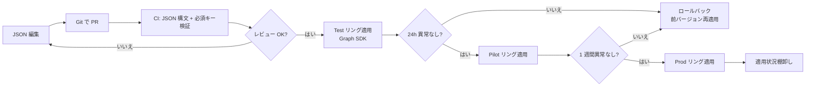

# M365 / Intune / Entra ID / Defender — ポリシー定義サンプル

社内 SE / 情シス補助で「M365 を運用できます」を見せるとき、画面操作の説明に留まると弱いので、**Graph API / Intune / 条件付きアクセスのポリシーをコード（JSON / PowerShell）で書ける**ことを示すための定義サンプル集です。

このフォルダの各ファイルは、Microsoft Graph PowerShell SDK / Microsoft Graph REST API を想定した JSON / PowerShell で、ポリシー名・対象・条件を読み取り可能な形でまとめています。**実行パスを用意した Intune 定義** と **設計のみの Conditional Access / Defender 定義** は、下表の状態欄で明確に分けます。

> 公開ポートフォリオ用の架空テナント値（`example.onmicrosoft.com` / `<group-id-here>`）です。実テナントに適用する前に、テスト用 OU / リング展開 / 影響範囲確認を必ず行ってください。

---

## 1. 収録ファイル

| ファイル | 種別 | 状態 | 用途 |
|---|---|---|---|
| [`intune-windows-compliance-policy.json`](./intune-windows-compliance-policy.json) | Intune Compliance | dry-run 自動検証対象 | Windows 11 端末の準拠（BitLocker / Defender / Firewall / Update） |
| [`intune-windows-configuration-profile.json`](./intune-windows-configuration-profile.json) | Intune Configuration | dry-run 自動検証対象 | 業務 PC の標準設定（電源 / Edge / SmartScreen） |
| [`conditional-access-baseline.json`](./conditional-access-baseline.json) | Conditional Access | 設計サンプルのみ | MFA 必須 / 準拠デバイス / レガシー認証ブロック |
| [`conditional-access-break-glass.json`](./conditional-access-break-glass.json) | Conditional Access | 設計サンプルのみ | Break-glass アカウント除外設定 |
| [`defender-attack-surface-reduction.json`](./defender-attack-surface-reduction.json) | Defender ASR | 設計サンプルのみ | Office マクロ / Web 経由実行ブロック等の ASR ルール |
| [`Apply-IntunePolicy.ps1`](./Apply-IntunePolicy.ps1) | PowerShell | Intune 2 種のみ対応 | Graph SDK で Compliance / Configuration を読み込むサンプル |
| [`Get-PolicyAssignmentReport.ps1`](./Get-PolicyAssignmentReport.ps1) | PowerShell | 読み取りサンプル | 既存 Intune ポリシーの割当状況を CSV 出力 |

---

## 2. 設計の柱

### ① ベースライン → リング展開
- 全社展開前に **テストリング** → **パイロットリング** → **本番リング** の 3 段で順次適用
- 各リングは AD グループ / Entra ID グループで管理（`Ring-Test` / `Ring-Pilot` / `Ring-Prod`）
- リングごとに不具合のフィードバックを受けてからリング進行

### ② Break-glass アカウントの除外
- 条件付きアクセスは **必ず緊急用アカウント（break-glass）を除外**しないと、ポリシー不具合時にテナントから締め出される
- break-glass アカウントは MFA 強制せず、長く強固なパスフレーズ + 物理保管 + 月次監査

### ③ 段階的な絞り込み
- 「**全員に MFA**」から始めず、まず管理者ロール → リスクサインイン検出 → 全員、と段階で広げる
- 条件付きアクセスは「除外」設定が複数重なるので、**1 ポリシー = 1 目的**で分割

### ④ Graph API 経由のコード化
- 画面操作（GUI）だけだと変更履歴が残らない
- Intune 2 種は JSON 定義 → Git 履歴 → CI dry-run → Graph SDK 適用パスまで示す
- Conditional Access / Defender は影響が大きいため、この公開 Lab では JSON 設計と展開判断までに留め、適用済みとは主張しない

---

## 3. 適用フロー（推奨）



### 適用コマンド例

```powershell
# 必要モジュール
Install-Module Microsoft.Graph -Scope CurrentUser

# サインイン（最小権限スコープ）
Connect-MgGraph -Scopes @(
    'DeviceManagementConfiguration.ReadWrite.All',
    'DeviceManagementApps.ReadWrite.All',
    'Policy.ReadWrite.ConditionalAccess'
)

# テストリングへ Compliance ポリシー適用
.\Apply-IntunePolicy.ps1 -PolicyFile .\intune-windows-compliance-policy.json `
    -TargetGroup 'Ring-Test'

# 24h 後、適用状況棚卸し
.\Get-PolicyAssignmentReport.ps1 -OutputPath .\report-2026-05-25.csv
```

`Apply-IntunePolicy.ps1` は Compliance / Configuration の 2 種だけを受け付けます。Conditional Access / Defender JSON を渡した場合は、設計のみの定義を誤って適用したように見せないため明示的に停止します。実テナントへの `-Apply` 実行結果は本ポートフォリオの検証範囲外です。

---

## 4. 本番展開で必ず確認すること

| 項目 | 確認方法 |
|---|---|
| Break-glass アカウントが除外されているか | 条件付きアクセス UI の「除外」セクション、JSON の `excludeUsers` |
| MFA 必須にする前に MFA 登録キャンペーン済か | Entra ID の MFA 登録レポート |
| Defender ASR が「監査モード」から「ブロックモード」へ移行できるか | 1〜2 週間監査モードで運用 → イベントログ確認 |
| Intune の準拠ポリシー違反時のアクション設計 | 即ブロック / 30 分猶予 / メール通知のどれか |
| ロールバック手順 | 前バージョン JSON を Git タグから取得、適用スクリプトで戻せる |
| 適用範囲外グループ | 派遣 / 業務委託 / 検証端末は別グループで除外 |

---

## 5. ポートフォリオでの位置づけ

- [Infra Operation Lab](../../infra-lab.html) の M365 / AD 想定運用の**コードレベルの根拠**
- [AD / M365 変更作業ケース](https://ns7jp.github.io/support-docs/ad-m365-change-case.html) の変更フローと、ここのポリシー JSON が **「型 ↔ 具体物」**の関係
- [Production Readiness](https://ns7jp.github.io/production-readiness.html) で挙げた「条件付きアクセス / Intune / Defender」を、文章でなく**実物の JSON** で示す

---

## 関連リンク

- [Infra Operation Lab](../../infra-lab.html) — Windows / M365 / AD 想定の運用設計
- [AD / M365 変更作業ケース](https://ns7jp.github.io/support-docs/ad-m365-change-case.html) — 部署異動を例にした変更フロー
- [チケット分類](https://ns7jp.github.io/support-docs/ticket-taxonomy.html) — 変更 (Change) の受付テンプレ
- [Production Readiness](https://ns7jp.github.io/production-readiness.html) — 本番化で足す観点
- Microsoft Learn: [Intune Configuration profiles](https://learn.microsoft.com/intune/configuration/) / [Conditional Access](https://learn.microsoft.com/entra/identity/conditional-access/)
