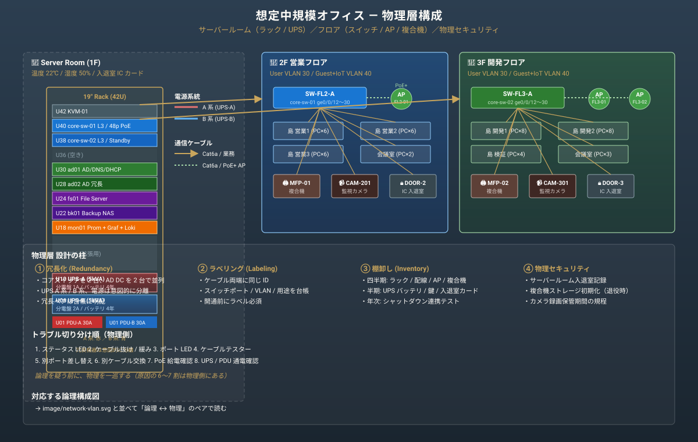

# オフィス IT / 物理層 — ラック・LAN・UPS・無線AP・複合機の運用設計メモ

社内SE / 情シス補助の現場では「論理ネットワーク」と同じくらい「**物理層**」が問われます。配線図、ラック搭載順、UPS の系統、無線AP の配置、複合機の故障対応など、現地での目視・テスター・予備機材で動く領域です。

このドキュメントは、[Infra Operation Lab](../infra-lab.html) の VLAN 論理構成図に対応する**物理レイヤ**を、棚卸テンプレ・配線図・UPS 設計・トラブル切り分け順で整理したものです。

> 公開ポートフォリオ用の架空フロア（中規模オフィス想定）の例です。実環境では建屋図面・分電盤系統・LAN 図と整合を取って読み替えてください。

---

## 1. 物理層 ざっくり構成図



論理側の [VLAN 構成図](../image/network-vlan.svg) と並べて、「**論理 ↔ 物理**」を 1 ペアで見せる構成です。

---

## 2. ラック搭載 棚卸テンプレ

`asset-rack-fs-2026q2.md` のような台帳でユニット単位に記録します。

| U 位置 | 機器種別 | 機器名 | 製造番号 / 資産番号 | 電源系統 | 接続スイッチ | 保守期限 | 備考 |
|---|---|---|---|---|---|---|---|
| U42 | KVM | KVM-01 | AS-K-001 | A 系 | — | 2028-03 | コンソール集約 |
| U40 | スイッチ | core-sw-01 | AS-N-010 | A+B 二重化 | upstream: ISP-A | 2027-12 | L3, 48p PoE |
| U38 | スイッチ | core-sw-02 | AS-N-011 | A+B 二重化 | upstream: ISP-B | 2027-12 | L3, 48p PoE / standby |
| U30 | サーバー | ad01 (DC) | AS-S-100 | A 系 | core-sw-01 ge0/0/1 | 2027-06 | AD DS / DNS / DHCP |
| U28 | サーバー | ad02 (DC) | AS-S-101 | B 系 | core-sw-02 ge0/0/1 | 2027-06 | AD DS 冗長 |
| U24 | サーバー | fs01 (File) | AS-S-110 | A 系 | core-sw-01 ge0/0/5 | 2027-09 | 部門共有 |
| U22 | サーバー | bk01 (Backup NAS) | AS-S-120 | B 系 | core-sw-02 ge0/0/5 | 2028-03 | RAID6, 24TB |
| U18 | サーバー | mon01 (Prom+Graf) | AS-S-130 | A 系 | core-sw-01 ge0/0/8 | — | Lab/監視 |
| U10 | UPS | UPS-A (5kVA) | AS-U-001 | 分電盤 1A | — | 2027-04 | A 系電源 |
| U06 | UPS | UPS-B (5kVA) | AS-U-002 | 分電盤 2A | — | 2027-04 | B 系電源 |
| U01 | PDU x2 | PDU-A / PDU-B | AS-P-001/002 | UPS-A / UPS-B | — | — | 各 30A |

### 棚卸し時の確認項目

- [ ] U 位置と機器の対応が台帳と一致しているか
- [ ] 電源系統 (A / B) が冗長機器で**確実に分かれているか**（写真で確認）
- [ ] LAN ケーブルにラベリングがあるか（両端で同じ番号）
- [ ] 保守期限 / 保守契約期間が切れていないか
- [ ] 予備機（コールドスタンバイ）の場所・通電試験記録があるか

---

## 3. LAN 配線設計 と ラベリング規則

### 3.1 ラベリング規則

ケーブル両端に同じラベルを貼り、台帳と一致させます。

```
SW-FL2-A03 ── Port 12 / VLAN 30 / 営業部 島3
                                       ↓
                              FL2-A03-12-営業3
                                       ↑
PC-EIG-042 ── 1G NIC
```

### 3.2 配線台帳テンプレ

| ケーブル ID | 種別 | 区分 | 起点（スイッチ / ポート） | 終点（壁口 / 機器） | VLAN | 長さ | 設置日 | 備考 |
|---|---|---|---|---|---|---|---|---|
| L-FL2-A03-12 | Cat6a | 業務 | core-sw-01 / ge0/0/12 | 壁口 営業3-A | 30 | 25m | 2025-04 | スタンダード PC 用 |
| L-FL2-A03-13 | Cat6a | 業務 | core-sw-01 / ge0/0/13 | 壁口 営業3-B | 30 | 25m | 2025-04 | |
| L-FL2-AP-01 | Cat6a PoE | AP | core-sw-01 / ge0/0/24 | AP-FL2-01 | 30 | 18m | 2025-04 | PoE+ 必須 |
| L-RACK-PRT | Cat6 | プリンタ | core-sw-01 / ge0/0/30 | MFP-01 | 30 | 10m | 2025-04 | 複合機 |

### 3.3 配線時の落とし穴

| 失敗例 | 影響 | 対策 |
|---|---|---|
| Cat5e を Cat6a の代わりに使う | 10G リンクが上がらない / 切れる | 規格を統一、ラベルに「Cat6a」明記 |
| 床下配線が**動力線と並走** | ノイズで通信エラー | 動力線と 30cm 以上離隔、必要なら STP / シールド管 |
| AP の PoE 給電容量を**スイッチで超過** | AP が落ちる、給電不安定 | スイッチの PoE バジェットを棚卸し時に確認 |
| ラベル無しで「とりあえず開通」 | 障害時にトレース不可 | 開通前にラベル貼付、台帳記入を作業手順に組み込む |
| ループバック作成 | ブロードキャストストーム | スイッチで RSTP / Loop Detection を有効化、未使用ポートは Shutdown |

---

## 4. UPS / 電源系統 設計

### 4.1 系統設計

```
分電盤 1A ─── UPS-A (5kVA) ─── PDU-A ─┬─ ad01 PSU1
                                       ├─ fs01 PSU1
                                       ├─ mon01 PSU1
                                       └─ core-sw-01 PSU1

分電盤 2A ─── UPS-B (5kVA) ─── PDU-B ─┬─ ad02 PSU1
                                       ├─ bk01 PSU1
                                       ├─ core-sw-02 PSU1
                                       └─ (各サーバー PSU2)
```

冗長サーバー（ad01/ad02、core-sw-01/02）は A 系 / B 系を**意図的に分離**します。ad01 と fs01 が同じ A 系に乗っているのは「DC は別ホストで冗長を取る」前提があるからで、根拠を台帳に明記します。

### 4.2 UPS の運用観点

| 項目 | 確認頻度 | 内容 |
|---|---|---|
| バッテリ寿命 | 月次 | 製造から 4 年経過したら計画交換 |
| 自己診断テスト | 月次 | UPS の Self-Test 機能を実行 |
| 負荷率 | 四半期 | 50% 以下を維持（フル負荷時のシャットダウン時間を確保） |
| シャットダウン連携 | 半期 | UPS → サーバーへの安全シャットダウン信号が機能するか実機テスト |
| 入力電源切替 | 年次 | 分電盤側のメンテで切り替え、UPS バッテリ運用の実機検証 |

### 4.3 停電時の動き（想定）

```
T+0:00  外部商用電源停止
T+0:00  UPS バッテリ運用開始 → 監視アラート発火
T+5:00  運用担当オンコール → 復旧見込み確認（電力会社 / ビル管理）
T+15:00 復旧見込み 30 分以上 → 非クリティカル機器（mon01 等）を計画停止
T+25:00 復旧見込みなし → クリティカル機器（ad01 / fs01）を UPS シャットダウン信号で OS シャットダウン
T+30:00 UPS バッテリ枯渇前に全機器停止完了
```

UPS のバッテリ持続時間は機器負荷と気温で大きく変わります。**机上計算ではなく実機テスト**で確認した時間を Runbook に書きます。

---

## 5. 無線 AP / Wi-Fi 設計

### 5.1 AP 配置棚卸テンプレ

| AP 番号 | 設置場所 | 接続スイッチ / ポート | チャネル (2.4 / 5GHz) | PoE 給電 | SSID | VLAN |
|---|---|---|---|---|---|---|
| AP-FL2-01 | 2F 営業エリア天井 | core-sw-01 ge0/0/24 | 1 / 36 | PoE+ | corp-staff / guest | 30 / 40 |
| AP-FL2-02 | 2F 会議室天井 | core-sw-01 ge0/0/25 | 6 / 44 | PoE+ | corp-staff / guest | 30 / 40 |
| AP-FL3-01 | 3F 開発エリア天井 | core-sw-02 ge0/0/24 | 11 / 52 | PoE+ | corp-staff / guest | 30 / 40 |

### 5.2 設計の考え方

- **SSID は最小限**: corp-staff（業務）/ guest（社外）の 2 種類が基本。SSID 数が増えると AP のオーバーヘッドが増える
- **チャネルは固定（自動配信は要監視）**: 隣接 AP との干渉を避けるため 2.4GHz は 1/6/11、5GHz は DFS を活用
- **VLAN 連携**: corp-staff → User VLAN 30、guest → Guest+IoT VLAN 40
- **WPA2/3 Enterprise**: corp-staff は RADIUS + AD 認証、guest はキャプティブポータル
- **VLAN 30 と 40 の分離**: AP 側で SSID と VLAN の対応が正しいか、AP コンソールで確認

### 5.3 トラブル切り分け順

```
1. 利用者の AP 接続状況確認（電波強度 / 接続 SSID）
2. AP 自体の状態（管理画面 / PoE 給電 / アンチパス）
3. AP の上流ポート（リンクアップ / VLAN トラッキング）
4. RADIUS サーバー応答（corp-staff 認証時）
5. DHCP / DNS（IP 取得後にも到達できないなら）
```

---

## 6. 複合機 (MFP) / プリンタ 管理

### 6.1 複合機 棚卸テンプレ

| 複合機 ID | 設置場所 | 接続 IP / ポート | スキャン宛先 | サポート期限 | 月次カウンタ |
|---|---|---|---|---|---|
| MFP-01 | 2F 営業 | 10.0.20.50 / core-sw-01 ge0/0/30 | scan@example.local (SMB) | 2028-03 | 14,230 / 月 |
| MFP-02 | 3F 開発 | 10.0.20.51 / core-sw-02 ge0/0/30 | scan@example.local (SMB) | 2028-03 |  3,840 / 月 |

### 6.2 よくあるトラブル

| 現象 | 一次切り分け |
|---|---|
| 印刷が出ない（特定ユーザー） | プリントジョブ確認 / ドライバ再インストール |
| 印刷が出ない（全員） | 複合機本体 / ジョブログ / IP / ポート確認 |
| スキャンが届かない | SMB 認証 / 共有フォルダ書き込み権限 / SMBv1 廃止影響 |
| 紙詰まりが多発 | 部品交換時期、サポートに保守依頼 |
| 月末に印刷が混む | キャパシティ計画見直し（リプレース or 増設） |

### 6.3 セキュリティ観点

- 管理画面のデフォルトパスワードは**必ず変更**
- スキャン宛先の SMB 認証は専用アカウント（個人アカウント禁止）
- ファームウェアは半期に 1 回適用、ベンダーの脆弱性通知を購読
- リプレース廃棄時は**ストレージ初期化**（複合機内に PDF キャッシュ残存）

---

## 7. 入退室 / 監視カメラ / 電気錠 の物理セキュリティ

| 項目 | 運用観点 |
|---|---|
| 入退室カード | 退職時に確実に回収、リーダーから ID 失効 |
| サーバールーム入退室 | 入退記録の月次レビュー、深夜帯入室は要事前申請 |
| 監視カメラ | 録画保存期間（社内規程に合わせる、30/60/90 日） |
| 鍵管理台帳 | 物理鍵を持つ人の棚卸し（半期）、退職者の鍵回収 |
| サーバールーム温湿度 | 24h ロガー、Slack/Teams 通知（25℃ / 60% 超で警告） |

---

## 8. 物理層トラブル切り分け順

「ネットワークが繋がらない」「サーバーから応答が無い」と言われたときの**物理側**の切り分け順です。

```
1. ステータス LED（リンク / アクティビティ / 障害ランプ）
2. ケーブル抜け / 緩み / 噛み込み確認（両端）
3. ポート LED（スイッチ側） / リンクアップ確認
4. ケーブルテスター（断線 / ピンアサイン）
5. 別ポートへの差し替えテスト
6. 別ケーブルへの交換テスト
7. PoE 給電確認（AP / IP 電話）
8. UPS / PDU の通電確認（前面 LED / 電圧表示）
```

論理層を疑う前に物理層を必ず一巡します。原因の **6〜7 割は物理側にある** という現場の経験則と整合します。

---

## 9. ポートフォリオでの位置づけ

- [Infra Operation Lab](../infra-lab.html) の **VLAN 論理図** と、本ドキュメントの**物理層**が 1 ペアで「論理 ↔ 物理」を見せる構成です
- [PC キッティング手順書](./pc-kitting-guide.md) と組み合わせると、端末から壁口、スイッチ、サーバー、UPS まで一気通貫で説明できます
- [障害対応事例集](./troubleshooting-case-studies.md) のネットワーク不通ケースは、ここの**物理切り分け順**が一次対応です

---

## 関連リンク

- [Infra Operation Lab](../infra-lab.html) — VLAN 論理構成図
- [PC キッティング手順書](./pc-kitting-guide.md) — 端末側の標準作業
- [障害対応事例集](./troubleshooting-case-studies.md) — 現象別の切り分けケース
- [Backup / Restore Runbook](./backup-restore-runbook.md) — fs01 / bk01 の運用
- [Production Readiness](../production-readiness.md) — 本番化で足す監査ログ・物理セキュリティ
