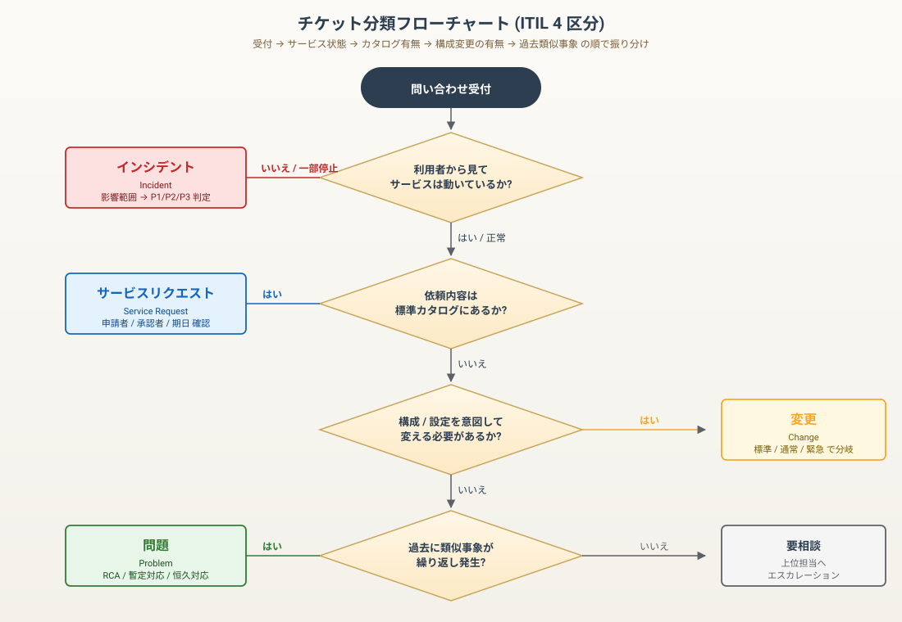
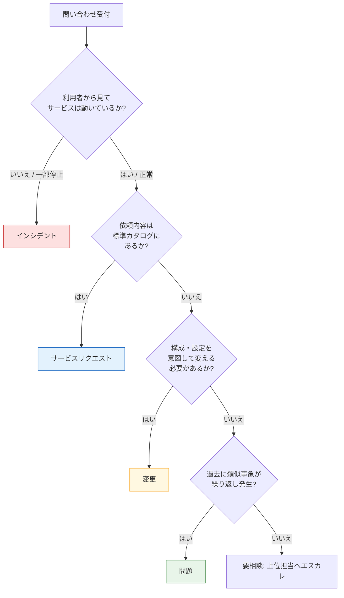

# チケット分類 / 受付の型（ITIL 4 区分）

ヘルプデスク / 社内SE の現場で最初に問われるのは「**この問い合わせは何の種類か**」の判断です。種類を間違えると、優先度・担当者・SLA・記録テンプレが全て噛み合いません。

このドキュメントは、ITIL の標準的な区分にあわせて **インシデント / サービスリクエスト / 問題 / 変更** の 4 種類を整理し、受付時に分類するためのフローチャートと、それぞれの受付テンプレートをまとめたものです。

> 用語と分類は ITIL 4 の Service Management Practices をベースにしていますが、用語は社内SEで一般的な表現に寄せています。

---

## 1. 4 区分のサマリー

| 区分 | 一言で | 例 | SLA（Lab 想定） | 主な記録先 |
|---|---|---|---|---|
| **インシデント** (Incident) | サービスが**期待通り動かない** | 「Outlook が起動しない」「共有フォルダが見えない」 | P1 1h / P2 4h / P3 1営業日 | チケット + Postmortem（P2 以上） |
| **サービスリクエスト** (Service Request) | 標準カタログにある**依頼** | 「新入社員 PC キッティング」「ライセンス追加」「共有権限の追加」 | カタログ別（多くは 3 営業日） | チケット + 申請台帳 |
| **問題** (Problem) | インシデントの**根本原因** | 「月1で発生する Outlook プロファイル破損の真因調査」 | 影響度別（緊急の脆弱性は 24h） | 問題管理台帳 + RCA |
| **変更** (Change) | 構成・設定を**意図して変える** | 「ADグループ構成変更」「FW ルール追加」「サーバー再起動」 | 標準変更 / 通常変更 / 緊急変更で分岐 | CAB 議事録 + 変更ログ + Runbook |

---

## 2. 受付時の分類フローチャート



<details>
<summary>テキスト版（Mermaid フローチャート）</summary>



</details>

### 補足 — 判断に迷う典型例

| 質問 | 判定 | 理由 |
|---|---|---|
| 「メール送受信ができない（本人のみ）」 | インシデント | サービスは動かない側 |
| 「メール送受信ができない（全社）」 | **重大インシデント (P1)** | 影響範囲が大きい |
| 「共有フォルダに同僚を追加したい」 | サービスリクエスト | カタログ標準作業 |
| 「FW ルール追加したい（業務新規）」 | 変更 | 標準カタログ外 / 意図的な構成変更 |
| 「同じ人で月 1 回 Outlook が壊れる」 | 問題（裏でインシデントは複数残す） | 1 回 1 回はインシデントだが、繰り返しの真因調査が必要 |
| 「Defender 定義が古い」(警報経由) | インシデント or 問題 | 1 台だけ → インシデント、全社規模 → 問題 |

---

## 3. インシデント受付テンプレ

```
■ 受付情報
- 受付日時      : 2026-05-25 09:32
- 受付者        : 島田
- 通報者        : 山田太郎（営業部）
- 連絡手段      : 電話 / 内線 1234

■ 現象（利用者の言葉そのまま）
共有フォルダ「営業」が開けない。「ネットワークパスが見つかりません」と表示される。

■ 影響範囲（最初の判定）
- 利用者数      : 1 名（本人のみ確認）→ 周囲 3 名に聞き取り → 部署全体 8 名で再現
- 業務影響      : 提案書アクセス不可、本日中の納品に影響あり
- 発生時刻      : 09:15 頃

■ 初期判定
- 重大度        : P2（部署単位、業務影響あり、当日中復旧必要）
- カテゴリ      : ファイルサーバー / 共有
- 関連サービス  : fs01

■ 切り分け（時系列で追記）
09:32 本人 PC で確認: \\fs01\営業 が開けない
09:35 別 PC（営業部 田中）で確認: 同じく開けない
09:38 fs01 への ping 不通 → ネットワーク側を疑う
09:42 fs01 へ SSH ログイン: SMB サービス停止確認 → 再起動
09:45 利用者で開封確認 OK
```

「**現象 → 影響 → 切り分け**」を必ず時刻付きで残します。後工程の Postmortem / 問題管理に直結します。

---

## 4. サービスリクエスト受付テンプレ

```
■ 申請情報
- 申請日時      : 2026-05-25
- 申請者        : 山田太郎（営業部）
- 承認者        : 営業部長 + IT 管理者
- 希望期日      : 2026-05-30
- カタログ      : 共有フォルダ アクセス権 追加（標準カタログ #SF-002）

■ 申請内容
- 対象          : \\fs01\営業\提案書
- 追加対象      : 田中花子（営業部 / 4/1 入社）
- 権限          : 読み取り + 書き込み
- 期限          : 無期限（部署所属中）

■ 事前確認（受付担当）
- [x] 申請書（PDF）添付済
- [x] 上長承認確認
- [x] 入社情報と整合
- [ ] AD グループ運用ルールに沿っているか確認 → SG-Eigyo へ追加で対応可

■ 作業
- 担当          : IT 運用 B
- 実施予定      : 2026-05-26 始業前
- ロールバック  : SG-Eigyo から削除
- 完了通知先    : 申請者 + 承認者
```

---

## 5. 変更受付テンプレ（標準 / 通常 / 緊急 で分岐）

```
■ 変更概要
- 変更番号      : CHG-2026-0145
- タイトル      : fs01 SMB バージョン v1 廃止、v2 / v3 のみ許可
- 種別          : 通常変更（標準カタログ外 / 影響範囲調査要 / CAB 承認必須）

■ 影響範囲と根拠
- 対象          : fs01 サーバー（営業 / 総務 / 開発 共有）
- 影響時間      : 22:00 - 23:00（業務時間外、影響想定なし）
- 影響利用者    : 0 名想定（v1 のみで接続している端末 0 台と棚卸し済）
- 根拠          : Defender for Endpoint の脆弱性レポート、社内 IT セキュリティ規程

■ 事前確認
- 棚卸しスクリプト    : Get-SmbVersionInventory.ps1 で接続元 SMB バージョン確認
- ベースライン       : 全 240 台で v2 以上を確認済（証跡: 棚卸し台帳 §3）
- バックアップ       : fs01 構成バックアップ取得（証跡: \\bk01\fs01-config\20260525）

■ 作業手順（Runbook 参照）
1. fs01 で SMB v1 無効化: Set-SmbServerConfiguration -EnableSMB1Protocol $false
2. Get-SmbServerConfiguration で v1 = False を確認
3. 利用者代表 3 名で共有アクセスのリトライ
4. 24 時間モニタリング後、変更クローズ

■ ロールバック
- 条件          : 利用者影響発生時 / 想定外端末で接続不可
- 手順          : Set-SmbServerConfiguration -EnableSMB1Protocol $true
- 所要時間      : 5 分以内

■ CAB / 承認
- レビュー日    : 2026-05-22
- 承認者        : IT マネージャー / 情報セキュリティ責任者
- 結果          : 承認
```

### 変更の3区分

| 区分 | いつ使うか | 例 |
|---|---|---|
| **標準変更** | リスク評価済・手順確立済 | PC キッティング、退職者アカウント停止、月次パッチ |
| **通常変更** | 個別のリスク評価が必要 | サーバー構成変更、FW ルール変更、AD 設計変更 |
| **緊急変更** | サービス停止リスクを伴う緊急対応 | ゼロデイ脆弱性対応、重大インシデント時の構成変更 |

---

## 6. 問題管理テンプレ（RCA / 5 Whys）

```
■ 問題情報
- 問題番号      : PRB-2026-0007
- タイトル      : Outlook プロファイル破損の繰り返し発生
- 起票根拠      : 過去 90 日で INC-2026-0421/0498/0612 の 3 件発生

■ インシデント履歴
| INC | 日時 | 影響範囲 | 暫定対応 |
|---|---|---|---|
| 0421 | 2026-03-12 | 営業部 1 名 | プロファイル再作成 |
| 0498 | 2026-04-08 | 総務部 1 名 | プロファイル再作成 |
| 0612 | 2026-05-19 | 営業部 1 名 | プロファイル再作成 |

■ 真因分析（5 Whys）
Q1: なぜプロファイルが破損したか?
A1: Outlook 起動中に PC がスリープ → スリープ復帰時に PST が不整合

Q2: なぜ Outlook 起動中にスリープが起きるか?
A2: 電源プランがデフォルトで「30 分」設定

Q3: なぜ電源プランがデフォルトのままか?
A3: キッティング手順に電源プラン設定の項目が無い

Q4: なぜキッティング手順に項目が無いか?
A4: 過去の手順を踏襲、改訂タイミングを設けていない

Q5: なぜ手順改訂のタイミングが無いか?
A5: 障害から手順への反映フローが整備されていない

■ 真因
キッティング手順に Outlook 利用前提の電源プラン設定が無く、改訂サイクルも整備されていない。

■ 対応
- 暫定 (5/22 完了) : 既知の影響範囲 12 名に手動で電源プラン変更
- 恒久 (5/30 予定) : キッティング手順書 §4 に追記、全 240 台へ GPO 配布
- プロセス (6/30) : 障害 → 手順改訂のフローを月次レビューに追加

■ クローズ条件
- 60 日間、類似 INC が再発しないこと
- 月次レビューで「手順改訂フロー」を運用していること
```

---

## 7. 受付時に必ず聞く 8 項目（共通）

| 番号 | 質問 | 目的 |
|---|---|---|
| 1 | 現象は何か（利用者の言葉そのまま） | 解釈を入れない |
| 2 | いつから発生しているか | 直近の変更との突き合わせ |
| 3 | 誰に発生しているか | 影響範囲の初期判定 |
| 4 | 直前に変わったことはあるか | 端末・社内・外部の変化 |
| 5 | 業務への影響度合いは | 優先度判定 |
| 6 | 再現するか / どうすると再現するか | 切り分け手順の組立 |
| 7 | 同じことが過去にあったか | 問題（Problem）への昇格判断 |
| 8 | 期待される復旧時間 | SLA と現実のすり合わせ |

「不調」「動かない」「遅い」のような曖昧な表現は、必ず**観測可能な動作**に翻訳してチケットに残します。

---

## 8. アンチパターン

| パターン | なぜダメか | 代替 |
|---|---|---|
| 全部「インシデント」で起票 | 標準作業まで個別評価され、台帳が肥大化 | カタログ化できる作業は**サービスリクエスト**に切り出す |
| インシデントを毎回プロファイル再作成だけで終了 | 真因に気付かず再発し続ける | 3 件以上同種が発生したら**問題管理**へ昇格 |
| 変更を「ちょっとした作業」で済ます | ロールバック不可、影響想定外で被害が拡大 | 標準 / 通常 / 緊急の 3 区分を運用し、CAB 通過の有無を明確化 |
| 「分からないので保留」 | 利用者からの信頼を失う | **要相談**を 1 つの状態にして、上位担当へエスカレ判断を残す |

---

## 9. ポートフォリオでの位置づけ

- 受付の型（このドキュメント）→ [障害事例集](./troubleshooting-case-studies.md) の現象別対応 → [インシデント対応プレイブック](./incident-response-playbook.md) の P1/P2 → [Postmortem 実例](./postmortem-example.md) の事後分析、と1本でつなぐ構成です。
- [変更作業ケース](./ad-m365-change-case.md) は本ドキュメントの「変更」テンプレの具体例（AD/M365 部署異動）として読めます。
- [SLO / Error Budget](./slo-error-budget.md) と組み合わせると、「**何件まで失敗を許容するか**」のチケット側のしきい値が決まります。

---

## 関連リンク

- [障害対応事例集](./troubleshooting-case-studies.md) — 現象別の切り分けケース
- [重大インシデント対応プレイブック](./incident-response-playbook.md) — P1/P2 発動時のフロー
- [Postmortem 実例](./postmortem-example.md) — 事後分析の実例
- [AD / M365 変更作業ケース](./ad-m365-change-case.md) — 変更テンプレの具体例
- [SLO / Error Budget](./slo-error-budget.md) — 失敗許容量の数値設計
- [Backup / Restore Runbook](./backup-restore-runbook.md) — RTO / RPO / DR ドリル
