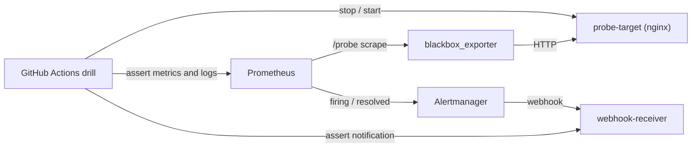

# Verified Infrastructure Lab #1 - Monitoring Incident Drill

設計資料だけでなく、実際に起動した監視構成で **正常確認 -> 障害注入 -> 検知 -> 通知 -> 復旧 -> 解消通知** を確認するための小さな実証 Lab です。

この Lab は Linux ホスト監視を題材にした Docker Compose 検証です。Windows / AD / M365 / AWS へ適用済みであることを示すものではありません。対象範囲は [詳細インフラ設計](https://ns7jp.github.io/detailed-infrastructure-design.html) の検証マトリクスに明記しています。

## 実証すること

| ステップ | 実行内容 | 成功条件 |
|---|---|---|
| 1. 起動 | Prometheus / Alertmanager / blackbox_exporter / 検証用 HTTP ターゲットを起動 | ready endpoint が応答する |
| 2. 正常確認 | blackbox_exporter が `probe-target` を HTTP probe | `probe_success = 1` |
| 3. 障害注入 | `probe-target` コンテナを停止 | `LabProbeTargetDown` が firing |
| 4. 通知 | Alertmanager が検証用 webhook へ配送 | `status=firing` が受信ログに残る |
| 5. 復旧 | `probe-target` を再起動 | `probe_success = 1` に戻る |
| 6. 解消通知 | Alertmanager が解消イベントを配送 | `status=resolved` が受信ログに残る |

## 構成



| 実体 | パス |
|---|---|
| コンテナ構成 | [`../monitoring-stack/docker-compose.yml`](../monitoring-stack/docker-compose.yml) |
| 外形監視設定 | [`../monitoring-stack/blackbox/blackbox.yml`](../monitoring-stack/blackbox/blackbox.yml) |
| SLI / アラート | [`../monitoring-stack/prometheus/alert.rules.yml`](../monitoring-stack/prometheus/alert.rules.yml) |
| 通知ルーティング | [`../monitoring-stack/alertmanager/alertmanager.yml`](../monitoring-stack/alertmanager/alertmanager.yml) |
| 障害注入スクリプト | [`scripts/verify-monitoring-lab.sh`](./scripts/verify-monitoring-lab.sh) |
| GitHub Actions | [`../.github/workflows/verified-lab.yml`](../.github/workflows/verified-lab.yml) |
| 初動手順 | [Verified Lab Runbook](https://ns7jp.github.io/verified-lab/runbook.html) |

## 実行

Docker と `curl` / `jq` が利用できる Linux 環境で実行します。

```bash
bash verified-lab/scripts/verify-monitoring-lab.sh
```

GitHub Actions では、監視設定または本 Lab が変更されるたびに同じドリルを実行し、`verified-monitoring-incident-evidence` artifact に次を保存します。

- UTC タイムスタンプ付きの検証サマリー
- 復旧後の `probe_success` API 応答
- 終了時の Compose 状態
- Alertmanager webhook を含むコンテナログ

## 証跡の読み方

このリポジトリに固定の「成功ログ」を手書きで置くことはしません。成功した workflow run と、その run が生成した artifact が実測証跡です。

- CI の成功: スクリプトが正常 -> firing -> 通知 -> recovered -> resolved の順を実際に確認したことを示す
- CI の失敗: 設定、起動、検知、通知、復旧のどこかが再現できなかったことを示す
- 架空の障害事例: 運用判断の書き方を示す資料であり、この Lab の実測値とは分離する

本番相当で追加する認証、TLS、外部通知、保持期間、秘密情報管理は [Production Readiness](https://ns7jp.github.io/production-readiness.html) に分離しています。
